# 飲食店マンタン注文用 タブレットアプリ

## アプリ概要
架空のファミリーレストランマンタンのタブレット注文用のアプリ  
フロントのみ チーム制作

## メンバー
- 上野獅旺
- 舘俊牙
- 桑原和希
- 鈴木芭陶

## 技術スタック
 - Next.js
 - TailwindCSS
 - Figma
 - Illustrator

## アプリ画面

<table>
  <tr>
    <td>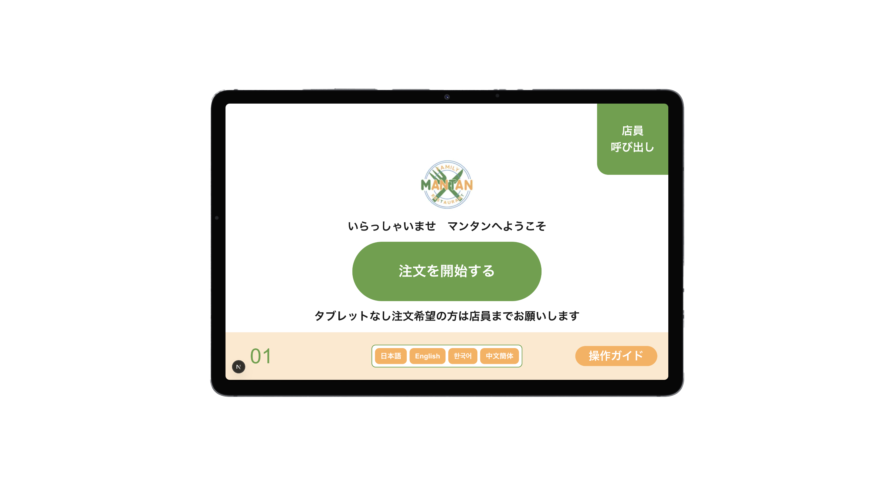</td>
    <td>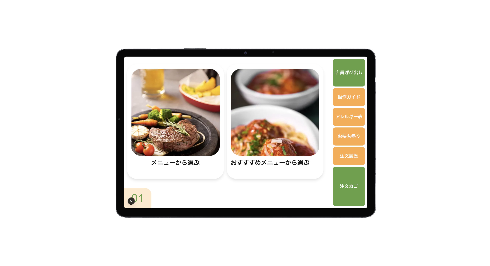</td>
  </tr>
  <tr>
    <td>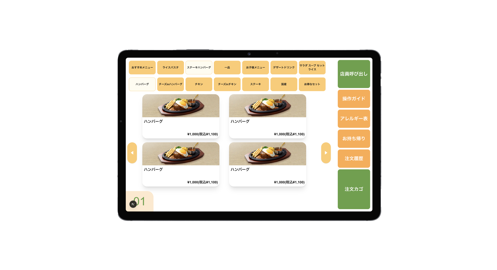</td>
    <td>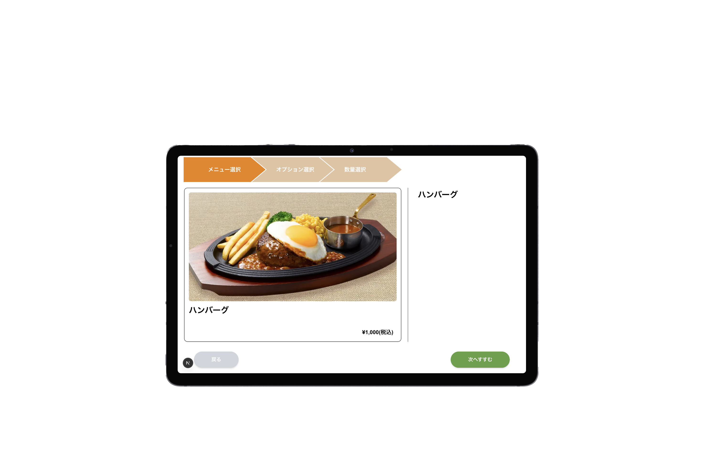</td>
  </tr>
  <tr>
    <td>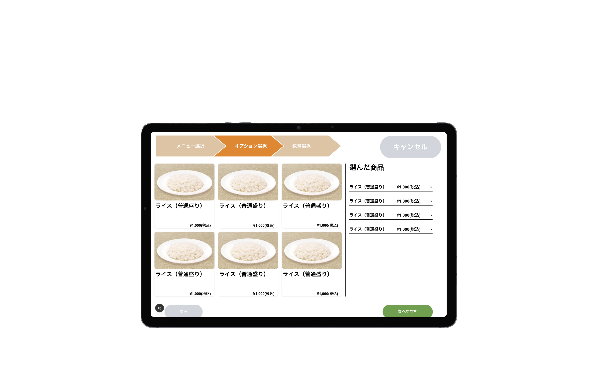</td>
    <td>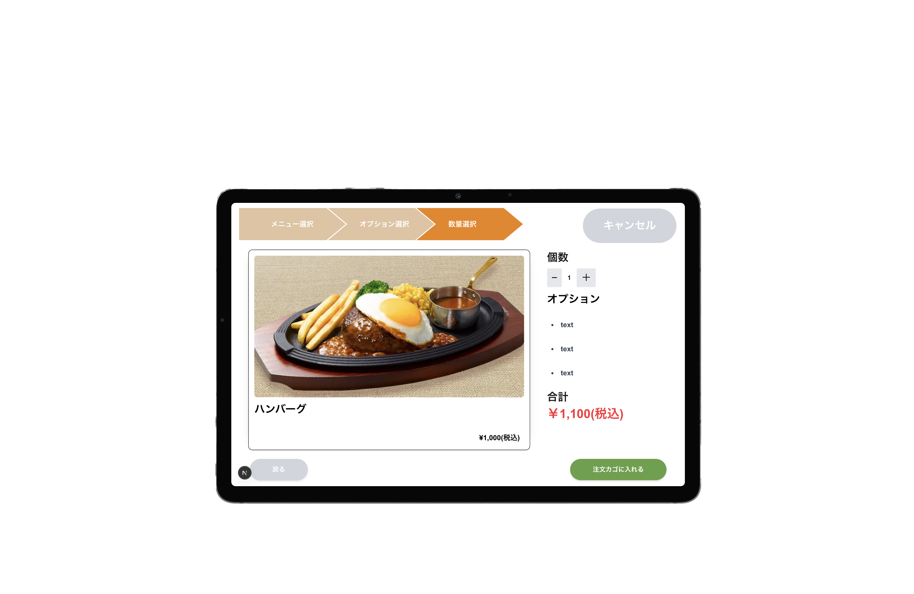</td>
  </tr>
  <tr>
    <td>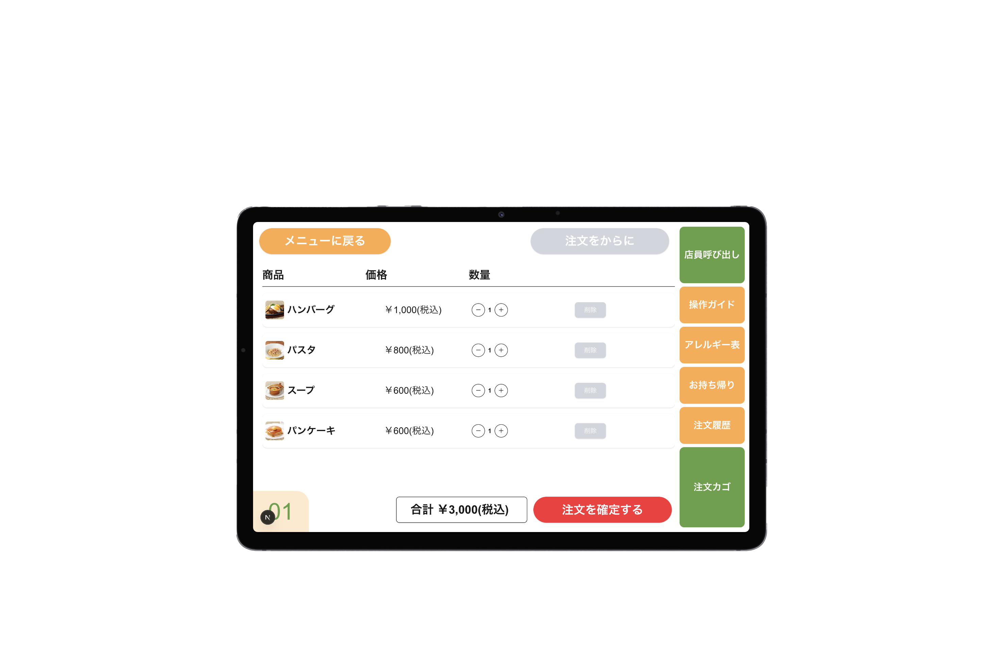</td>
    <td>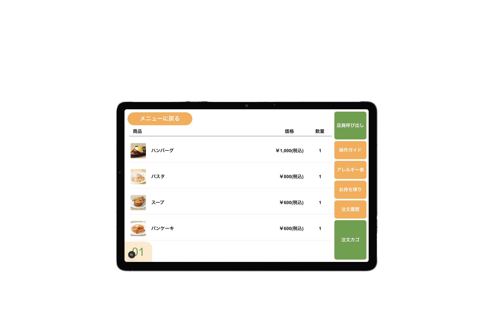</td>
  </tr>
  <tr>
    <td>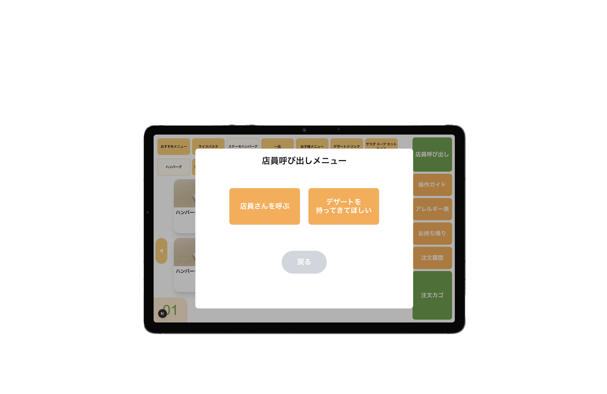</td>
    <td>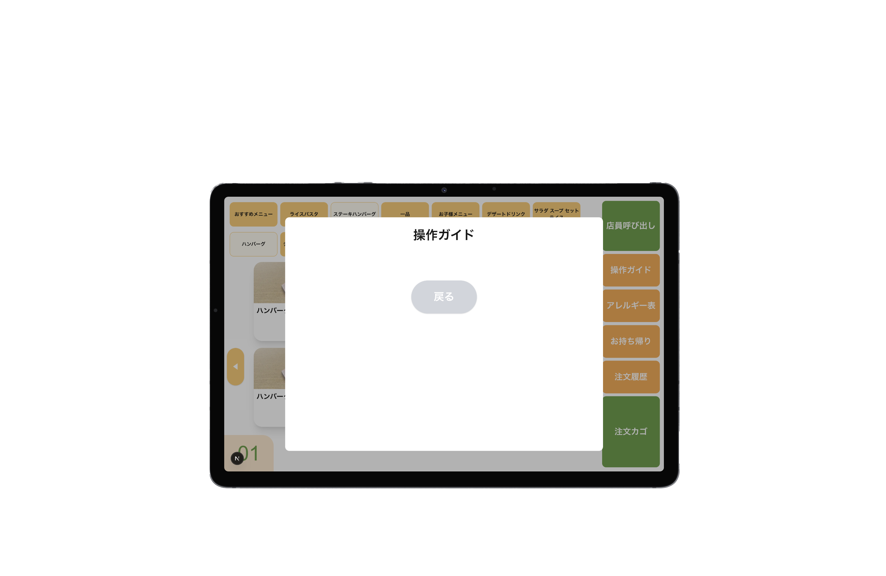</td>
  </tr>
  <tr>
    <td>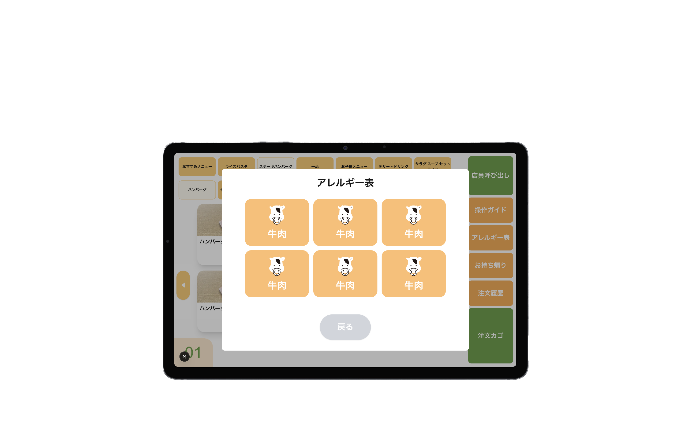</td>
    <td>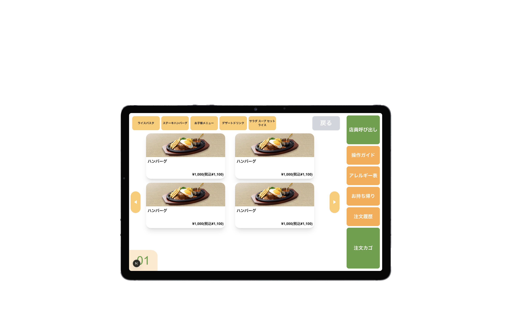</td>
  </tr>
</table>

 

## 課題
デザインがタスク配分や予定の調整などをうまくできなかったためシンプルになってしまった。 
夏休みを挟んだことによって作業が止まってしまっていた。

## 感想
タスク管理や時間配分の大切さをもろに感じる制作だった。 
次はもっとできなかった部分を意識して制作したい。

